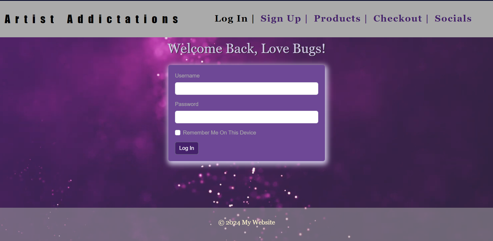

# artist-e-commerce

## Table of Contents
- [Introduction](#introduction)
- [Features](#features)
- [Screenshots](#screenshots)

## Introduction
Artist Addictations is an artistic haven for those passionate about unique and expressive artwork. Our platform features a curated collection of digital and traditional artworks, highlighting the talents of Taylor and Jamirah, two artists with distinct styles and shared dedication to their craft. The website serves as both a portfolio and an e-commerce platform, allowing visitors to explore, learn about, and purchase original pieces from our collections.

## Features
- Responsive Design: The website is fully responsive, ensuring an optimal viewing experience across various devices and screen sizes.
- Dynamic Content: A featured carousel on the homepage showcases upcoming collections and highlights, offering a sneak peek into new and exciting artwork.
- Artist Profiles: Detailed biographies and images of the artists provide insight into their creative journeys and artistic philosophies.
- Product Showcase: The platform features an organized and easily navigable display of available artworks, complete with high-quality images and detailed descriptions.

## Screenshots

Home Page: Introduces visitors to the platform with a rotating carousel of featured artworks and upcoming collections.

Login Page: Allows existing users to securely log in to their accounts.

Registration Page: Enables new users to create an account by providing necessary information.

Products Page: Displays a catalog of available artworks, including details and purchasing options.

Checkout Page: Facilitates the process for users to review their cart and complete purchases. 

Social Page: Provides links and information to follow the artists and platform on various social media channels.